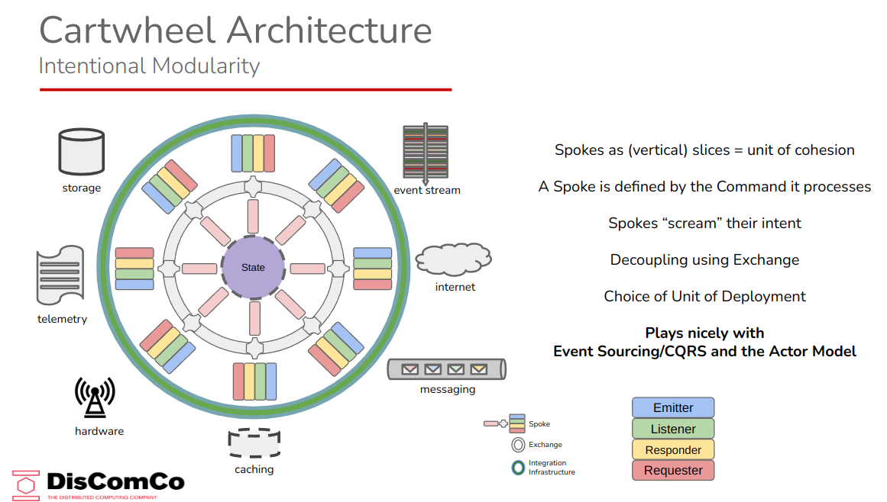
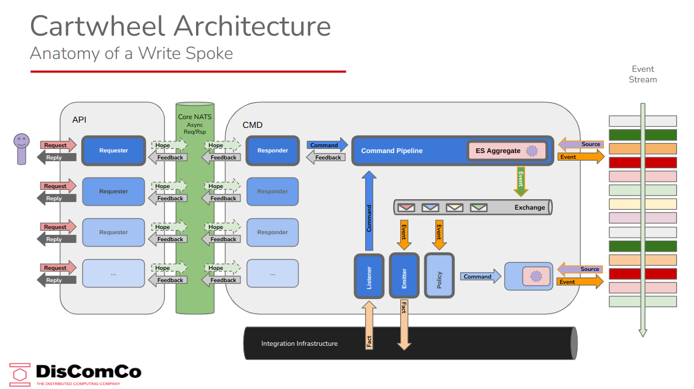

# The DotCart Toolbox

> **DotCart** stands for **Cartwheel Architecture for DotNET**.

The **DotCart SDK** is an open toolbox for developing **modular, behavior-centric DotNet applications** that use **Event Sourcing with CQRS**: a paradigm that is based on writing state changes (_Events_) to an immutable, append-only log, whilst using  interpretations thereof (_Projections_) for materializing views that are read-optimized for specific use cases.

## Purpose

 > _Event Sourcing with CQRS_ is often considered emerging, difficult and regarded as adding 'unnecessary' complexity to systems.  
 Though this is a very opinionated view, it usually results in teams opting for a more traditional CRUD-based approach, even if this brings its own challenges and complexities down the road.

This toolbox addresses these concerns by eliminating the need for hand-crafted boiler plate code and offering a 'yellow brick road to ES/CQRS', so that engineers can focus on implementing business value.  
Additionally, it aims to bring uniformity to the codebase both in structure as in nomenclature, so that developers can easily cross-over from one domain to another, reducing ramp-up time to almost zero.  
The outcome of implementation, is a highly modular solution, that is bounded by behavior (a process), open for integration and liberal in deployment.

## ERcNC Application Stack

The DotCart SDK is open and extendible, using driver-based integration.  

However, for applications we prefer the _ERcNC_ Stack.

E - [EventStoreDB](https://eventstore.com) (for storing Event Streams and consuming Projections)  
R - Redis (for caching/storing Read Models)  
cN - core NATS (for inter-process, location-transparent async Req/Rsp and Pub/Sub)  
C - CouchDB (as a persistent document database)

## Outline

- [The DotCart Toolbox](#the-dotcart-toolbox)
  - [Purpose](#purpose)
  - [ERcNC Application Stack](#ercnc-application-stack)
  - [Outline](#outline)
  - [Cartwheel Architecture (CA)](#cartwheel-architecture-ca)
    - [WRITE Spokes (W-Spoke)](#write-spokes-w-spoke)
      - [Write2Stream variant](#write2stream-variant)
      - [Write2Project variant](#write2project-variant)
  - [Getting Started](#getting-started)
    - [Schema First](#schema-first)
    - [Behavior](#behavior)
  - [Motivation](#motivation)
    - [as a **Software Engineering Manager**](#as-a-software-engineering-manager)
    - [as a **Software Architect**](#as-a-software-architect)
    - [as a **Software Engineer**](#as-a-software-engineer)
  - [Documentation](#documentation)
    - [Core SDK Packages](#core-sdk-packages)
      - [DotCart.TestKit](#dotcarttestkit)
      - [DotCart.TestFirst](#dotcarttestfirst)
      - [DotCart.Abstractions](#dotcartabstractions)
      - [DotCart](#dotcart)
  - [Development](#development)

## Cartwheel Architecture (CA)

Cartwheel Architecture aims at providing an unambiguous definition for _Module_. Modules in CA jargon are called _Spokes_ and since CA uses CQRS, there are two types: **READ Spokes** and **WRITE Spokes**.  

 

### WRITE Spokes (W-Spoke)

> A WRITE Spoke is responsible for processing a single Command.

While reflecting on a W-Spoke's anatomy, it became clear that two  distinct variants can be identified: the **Write2Stream** and the **Write2Project** variants.

#### Write2Stream variant

The Write2Stream variant's responsibility end at the moment when the Event is appended to the Event Stream and typically contains the following actors:

- The **Exchange** (required, injected)
- One **Responder** (required)
- One **Command Pipeline** (required) containing:
  - A number of **Specifications** (middleware)
  - A reference to the **Event Sourcing Aggregate** (required, Injected)
  - One **Try** function (required)
  - One or more **Apply** functions (one for each event that is emitted by the pipeline)
- A number of **Domain Policies** (optional)
- A number of **Fact Emitters** (optional)
- A number of **Fact Listeners** (optional)



#### Write2Project variant

> PROJECTIONS  
a _pure projection_ is a function that has an _Event_ and a certain _Read Model State_ as inputs and a _Mutated Read Model State_ as output.


## Getting Started

> This brief Quick Start guide assumes that during the lifetime's discovery phase, a techniques like Event Storming was used to discover the dynamic (behavioral) and DDD for the static (structural) aspects of the system under development.

### Schema First

Everything starts with the _domain schema_: an anemic, static and rooted data structure that represents the application's _default read-model_, which lives at the core of the application.  
This schema defines the structures that will contain the _Volatile State_, that will be calculated by the Event Sourced Aggregate.

### Behavior

> SPOKES  
> Cartwheel 

Next, developers will implement the Spoke's Behavior. This consists of a **single** command, one or more events. Commands and Events all have a Payload, which is specific per command and can mostly be reused as payload for the emitted event.

 nodule (a "_Spoke_") for each command that must be processed.

One _Spoke_ (module) starting with  which are identied via the towards a collection of active, always-on, actor-like components, that operate against the infrastructure and marshal commands and events in and out of the business logic, which is maintained at the center of the application in a so-called _event-sourced aggregate_.

## Motivation

### as a **Software Engineering Manager**

> I require **a way to normalize the software manufacturing process**
> so that **software creation becomes a predictable, repeatable and scalable activity, both in velocity and quality**

### as a **Software Architect**

> I want to be able **to provide a unified approach to solving non-functional requirements**
> and **empower software engineers with tools that minimize boilerplate code**
> and **offer tools that normalize the software manufacturing process**
> in order to **provide a consistent level of quality**
> and **achieve a predictable manufacturing process**

### as a **Software Engineer**

> I require **a set of base artifacts and patterns**
> so I will **be able to focus on implementing business logic**
> and **not have to worry about non-functional requirements**
> and can **avoid to implement recurring boilerplate code**

## Documentation

This SDK is built with application modularity in mind.

More details about the design phylosophy and inner structures of DotCart Applications can be found here:

- [Bounded by Behavior](https://docs.google.com/document/d/1io3HsGItmu02Nx4hHru9wVLnF6lTiQDVecko-ga6Pg0/edit?usp=sharing)

### Core SDK Packages

#### DotCart.TestKit

Purpose: Provide a number of base and helper classes that simplify testing using Dependency Injection

#### DotCart.TestFirst

#### DotCart.Abstractions

#### DotCart


## Development

For Development we can recommend this stack:

- [DisComCo Compose Dev Stack](https://github.com/discomco/compose-dev-stack)

Usage:

```bash
git clone https://github.com/discomco/compose-dev-stack
cd compose-dev-stack
./run-minimal.sh -d
```
