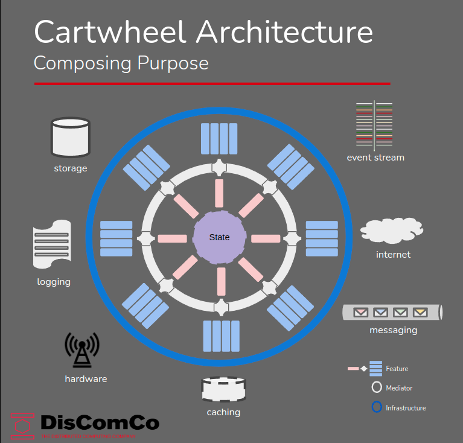
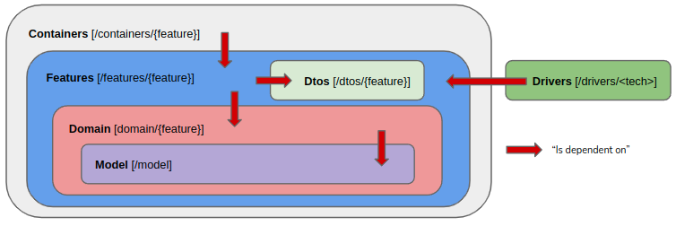

# The DOT-CART Ecosystem

## TABLE OF CONTENTS
- [The DOT-CART Ecosystem](#the-dot-cart-ecosystem)
  - [TABLE OF CONTENTS](#table-of-contents)
  - [DESCRIPTION](#description)
  - [MOTIVATIONS](#motivations)
  - [DEFINITIONS](#definitions)
    - [Purposeful Architecture](#purposeful-architecture)
    - [The Cartwheel Monolith](#the-cartwheel-monolith)
    - [Event Storming](#event-storming)
      - [Events](#events)
      - [Commands](#commands)
      - [Big Picture](#big-picture)
      - [Context](#context)
    - [Domain Driven Design (DDD)](#domain-driven-design-ddd)
      - [Identity](#identity)
      - [Aggregate Root](#aggregate-root)
      - [Entity](#entity)
      - [Value Object](#value-object)
    - [The Aggregate](#the-aggregate)
  - [DOT-CART Applications](#dot-cart-applications)
  - [ANATOMY of a DOT-CART Application](#anatomy-of-a-dot-cart-application)
    - [Model [/model]](#model-model)
    - [Domain [/domain/{feature}]](#domain-domainfeature)
      - [for CMD Applications](#for-cmd-applications)
      - [for PRJ Applications](#for-prj-applications)
      - [for QRY Applications](#for-qry-applications)
    - [Features [/features/{feature}]](#features-featuresfeature)
      - [for CMD Applications](#for-cmd-applications-1)
      - [for PRJ Applications](#for-prj-applications-1)
      - [for QRY Applications](#for-qry-applications-1)
    - [Dtos [/dtos/{feature}]](#dtos-dtosfeature)
    - [Containers [/containers/{feature}]](#containers-containersfeature)
    - [Drivers [/drivers/{tech}]](#drivers-driverstech)
  - [DEVELOPING DOT-CART Applications](#developing-dot-cart-applications)
    - [Setting up the local development environment](#setting-up-the-local-development-environment)
    - [Developing CMD Applications](#developing-cmd-applications)
    - [Developing PRJ Applications](#developing-prj-applications)
    - [Developing QRY Applications](#developing-qry-applications)
  - [SOME REFERENCES](#some-references)
  - [SERVERLESS DEPLOYMENT?](#serverless-deployment)

## DESCRIPTION
The DOT-CART Ecosystem  provides a basis for developing modular applications for EventSourcing/CQRS in C#.NETCore

## MOTIVATIONS
- as a **Software Engineering Manager**
  - I require **a way to normalize the software manufacturing process** 
  - so that **software creation becomes a predictable, repeatable and scalable activity, both in velocity and quality**
- as a **Software Architect**
  - I want to be able **to provide a unified approach to solving non-functional requirements** 
  - and **empower software engineers with tools that minimize boilerplate code**
  - and **offer tools that normalize the software manufacturing process**
  - in order to **provide a consistent level of quality**
  - and **achieve a predictable manufacturing process**
- as a **Software Engineer**
   - I require **a set of base artifacts and patterns**
   - so I will **be able to focus on implementing business logic**
   - and **not have to worry about non-functional requirements**
   - and can **avoid to implement recurring boilerplate code**

## DEFINITIONS
### Purposeful Architecture
>**Purposeful Architecture** is a form of screaming architecture, which advocates the clear communication of purpose, where artifacts are immediately recognizable by all stakeholders. 

This leads to implementations where **modularity** becomes a key priority and encourages the creation of applications by composition, using **dependency injection**, producing "Cartwheel Monoliths", a form of Modular Monolith, where the bounded context is defined by dynamic behavior models (the process), rather than static domain models. 

- This SDK supports the **Cartwheel Architecture** in combination with **Event Sourcing/CQRS** and **Feature Slicing**, which results in a modular application. 
- Modules inside this monolith are decoupled and act as internal nanoservices that communicate over an internal eventbus aka the *Mediator* 

### The Cartwheel Monolith
>**Is a modular application that combines the principles of Clean Architecture with Feature Slicing (aka Vertical Slicing), where each slice must be internally decoupled and individually testable.**

The intent of the application must become clear to all stakeholders, at first glance.
The outcome is a modular application, in which each of the components is independent from the rest of the system, 
whilst internal communication is achieved using the **Mediator Pattern**



### Event Storming
>**Event Storming** is a *discovery practice* that is rapidly gaining momentum in the industry, because of its inclusive and intuitive nature. Its aim is to discover the expected **behaviour** of systems under design. This is done in low-tech, semantically liberal workshops where domain- as well as technology experts participate in *event-centric* brainstorming. The outcome of these sessions are a Context Map (aka 'Big Picture') and a number of *Contexts* which describe the processes and their interactions with users, other contexts or external systems.

There is some jargon involved, which we shall briefly clarify.
#### Events
#### Commands
#### Big Picture
#### Context

### Domain Driven Design (DDD)
>**DDD** is a popular *discovery practice* that offers the tools to reason and analyse the static data  >structures of a business domain. 

There is some jargon involved, which we shall briefly clarify:
#### Identity
By convention, we identify an *IDentity* as a structured type that has a prefix and a value and in code, variables that represent IDentity types have the 'ID' suffix (i.e. carID). The string representation of an IDentity always has the form "prefix-value" and those variables can be recognized in code by their 'Id' suffix (i.e. carId).  
#### Aggregate Root
#### Entity
#### Value Object
### The Aggregate

>**The Aggregate** in event sourced applications is the equivalent of the ActiveRecord in classic CrUD (Create, Upsert, Delete) applications.
>It truly is the heart of an ES system, that unites State and Behavior.
>Its main responsibilities are:
> 1. to build a (volatile) State from an ordered list of previously committed Events, that are sourced from the Event Stream that is identified by the AggregateID.
> 2. Accept Command requests and apply business logic that checks whether the Command (ICmd) is allowed to be executed or not, according to a number of Specifications, the Current State of the Aggregate and the Command's payload.
> 3. If Command execution is allowed, Raise a new Event and Apply it to itself, as to update the Current State to the New State.

Specifically for DOT-CART CMD Applications, given their modular nature, we rely on *Aggregate Composition*.
>**Aggregate Composition** is a technique that allows us to inject the IApplyEvt and ITryCmd injectors, in order to compose an Aggregate that has all the capabilities required to process the full Event Stream.

## DOT-CART Applications
There are 2 types of DOT-CART applications: 

>- **Command (CMD)** applications  
>   - accept and evaluate commands and 
>   - write the resulting events to the EventStore
>   - subscribe to the event stream and *Project* these events onto the default Document- and List Models
>   - Write these models to the cache and data stores
>- **Query (QRY)** applications
>   - execute query requests and 
>   - return the results
  
All have the same basic structure: they are composed of function-specific features. CMD apps are composed of CmdFeatures, PRJ apps have PrjFeatures and QRY apps have QryFeatures.

## ANATOMY of a DOT-CART Application
As stated before, a DOT-CART application builds on the principles of Clean Architecture,
which means that **dependencies point inwards**. We can visualize this as follows:



We will now describe these different shells from the inside out, which also the recommended order for developing DOT-CART Applications. 
>**Developers are expected to start with the model package and work their way outwards, in a test-driven manner!**
### Model [/model]
- At the core of a an applications sits the **model**, which contains the static data structures that represent the state of information in the system. These are **POCOs** (Plain Old C# Objects), that implement the data model. In this layer, we use DDD terminology to reason about things like aggregate *root* objects, *entities* that have an *IDentity* and *Value Objects*, which are structs without identity. 
> **Model artifacts reside in the /model package**
### Domain [/domain/{feature}]
- The Domain shell is the heart of application. This is where the behavior or business logic is implemented. This is the *only* place in the application where logic should be implemented.   
> **Domain artifacts reside in the /domain package, which is refined using sub-directories that are named after the individual features**
#### for CMD Applications
 This is where artifacts like *Commands* (domain.ICmd), *Events* (domain.IEvt) and the **Aggregate** live. In an ES/CQRS system, the Aggregate is the crucial part of the application: It receives requests to execute commands via a Command Handler (we will explain this component later), evaluates these request against the **Current State**, using business logic defined in **Specifications** and if the command is allowed to be executed, it will create and raise *one or more* domain Events, which will then be applied to the Aggregate itself, in order to update the Current State to the New State. This is an essential step in the practice of Event Sourcing.
- Since a DOT-CART application is feature-sliced, Aggregates are composed using *ITryCmd* and *IApplyEvt* injectors. Each feature provides exactly one of each. 
- The ITryCmd will extend the domain.TryCmd structure and implement a **raiseEvent** function, The purpose of this method is to perform the specific logic related to the ICmd it processes and will raise an IEvt when successful. 
#### for PRJ Applications
#### for QRY Applications


### Features [/features/{feature}]
The **Features** shell forms the link between the **Domain** and the *backend services*. 
In other words, it allows the Domain to interact with the outside world and generate or respond to  *side effects*. 
- **Infrastructure artifacts reside in the /features package, which is refined using sub-directories that are named after the individual features**
#### for CMD Applications
- This shell contains 4 distinct types of artifacts: 
  - Command Handlers (exactly 1 per Feature), 
  - Event Handlers, 
  - Fact Listeners and 
  - Hope Responders.
#### for PRJ Applications
#### for QRY Applications

### Dtos [/dtos/{feature}]
The **Dtos** shell contains the *Data Transfer Objects*, these are the objects that are exchanged by the container and the outside world, for integration purposes. CMD amd PRJ applications will work with *Hope* (dto.IHope), *Fact* (dto.IFact) and *Feedback* (dto.IFbk) objects, QRY applications will work with *Query* (dto.IQry) and *Response* (dto.IRsp) objects. 

### Containers [/containers/{feature}]


### Drivers [/drivers/{tech}]
- Is the umbrella term for actors outside of the application boundaries.
- We indicate DOT-CART applications, external services, specialized backend services like for instance databases, message brokers and even user interfaces.
- 

## DEVELOPING DOT-CART Applications

### Setting up the local development environment

For local development, we recommend the [compose-dev-stack](https://github.com/rgfaber/compose-dev-stack). 
<br>
usage:
```bash
git clone https://github.com/rgfaber/compose-dev-stack
./run-minimal.sh -d
```

### Developing CMD Applications


### Developing PRJ Applications

### Developing QRY Applications


## SOME REFERENCES
- [Event Sourcing/CQRS - Greg Young](https://youtu.be/8JKjvY4etTY)
- [Event Storming - Alberto Brandolini](https://youtu.be/mLXQIYEwK24)
- [Microservices - Allard Buijze](https://youtu.be/jrbWIS7BH70)


## SERVERLESS DEPLOYMENT?
One may notice that this architecture, due to its decoupled and modular nature, has many similarities with the concept of **Functions as a Service** (FaaS). One of the major issues that FaaS platforms struggle with is how to implement event sourced systems. This architecture does not pretend to have the solution for this problem, but **Agregate Composition** may offer a path forward. Should decomposing the Screaming Monolith into functional nanoservices become an option or a necessity one day, packaging each feature as a function and deploying it to a "serverless" infrastructure like OpenFaaS, should require minimal effort.